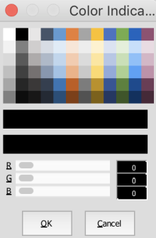
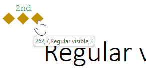
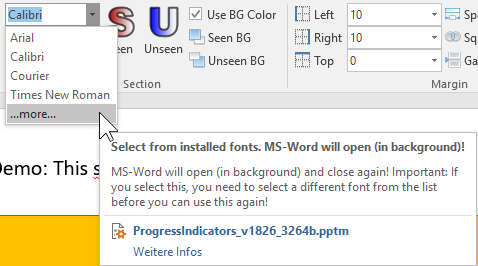
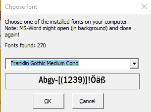
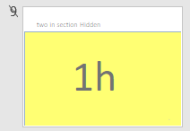

Finally: A custom Progress Indicator for your PowerPoint presentation
---

# The Problem

PowerPoint is the dominant presentation software, but lacks some helpful features to give your audience a hint how much they have seen already and how much still to be expected. Maybe you have some chapters/sections in your presentation - and you want your listeners also know about those.

There is no internal possibility to create a progress indicator in PowerPoint. There are some scripts on the web - but they are quite hard to find and harder to use. Furthermore: They are way not as advanced as this – free and open source (!) – Powerpoint add-in!

# The Solution: This Tool

The Progress Indicator was originally developed by [Edgar Loper](http://ed.loper.org/projects/progress_dots/), modified by [Adam Wilson](http://adamwilson.us) and heavily extended by [Olaf Nöhring](http://www.datenbank-projekt.de/index.php/kontakt).  See [Olaf's webpage about the project  here](http://www.datenbank-projekt.de/index.php/beispiele/progress-indicator-powerpoint-2010-2013-2016-32-and-64-bit-windows-and-mac-os)

It should work on Microsoft Office 2016 (also 2010 and 2013), 32bit and 64bit versions and on MAC OS as well as on Windows! This page illustrates some features and includes a download link directly from the (last) developer.

Is this macro safe? Yes. Also, you get not only the PowerPoint add-in, but also the source code so you can always check it out yourself (and change it if you like).  If you are interested in contributing to the development of the add-in contact me directly or see the [github page to contact Adam](https://github.com/AdamWilsonLab/progress_indicators).

## So tell me, what does it look like? What can it do?

It looks like this, shown is version 1.826 in Windows 10 with MS-Office 2016:

Version 1.826 in MS-Office 2016 on MAC OS X:

As you see, the Progress Indicator (macro/add-in) will create a new tab in the ribbon. All options on this tab have keyboard shortcuts (press ALT in PowerPoint and watch what happens). The ribbon is split into several parts (Indicator, Shape, Section, Margin, Slide and Ignore), most of the icons are from FatCow.

If change any settings in the ribbon, the Progress Indicator will immediately update (or create) indicators with those settings. Please note, that if you change a value in the dropdown fields by hand, you need to press the Enter key after you have entered the value to make the ribbon recognize the change. If you are working with a large presentation and the automatic updates are too slow, simply uncheck auto-update (then click create when you want to update the indicators). But don‘t forget: If you change your presentation, add/delete/reorder slides/sections you will need to click create to update the Progress Indicator!

We tried to make the Progress Indicator work exactly the same way on Windows and MAC. This was not always possible. Please read the following documentation where we point out known differences.

## Let's go into some details

### Indicator

* Create generates or updates the indicators (the shapes and, if available and used, the section title).
* Usually every time you change something on the ribbon the indicators will be updated - you get a live (pre)view! You can prevent from auto updating by unchecking the Auto-Update box. As Auto-Update redraws all indicators after every change you make, this might slow down your workflow – especially when working with large presentations.
* Remove removes all indicators and titles, but the settings will stay in your presentation. You can use the Create button later to apply the last settings and redraw the indicators.
* Help opens a help window with some hints and tricks – and a link to my website

### Shape

* You can choose the type of the indicator from 196 predefined shapes that come with MS Office. Some common ones can be found additionally on top of the list.
* The list of indicators/shapes also contains some with visual hints (Windows and MAC version shown):

 

### Change the Size of the indicator
Set the color for the indicator when a slide was already seen (Seen) and not yet seen (Unseen).

### Colors

You love colors? Sure you do, and thus we provide you with an easy way to adjust the colors (all of them in Shape, Section) very simple. We created a color-chooser for you (images show Windows and MAC version). Whenever you press a button the color-chooser will open. The title of the window will let you know what color you are working on, the old color, as well as a preview for the new color will be displayed.

The color chooser allows to change the colors by:
* choose from a set of colors. These colors are calculated each time from the current theme colors. This means, after changing your theme you can easily adjust the indicator colors to match!
* Typing red-green-blue (RGB) values (0-255)
* Dragging the RGB sliders

### Easy navigation with hyperlinks

Each indicator is also a link to that slide, so are the section titles. Links work only when you start your presentation, not in design view!

* Clicking on the indicator will take you to the specific page
* Clicking on the section title will take you to the first page of that section.
* Windows version only (sorry Mac users): When you hover (mouse over) the indicator/section title you will see something like this: 262,7,Regular visible,3
   * 262 is the ppt internal presentation unique ID which never changes (and is needed for the link to work)
   * 7 is the slide number in your presentation "development" window
   * Regular visible is the slide title (is one exists, otherwise "-" will be shown)
   * 3 is the slide with the third indicator

## Section

Sections are a Powerpoint feature to organize your slides into different parts. Think of those as topics or chapters in a book. You can add sections in development view in the miniature view or in the slide sort view by simply right clicking and choosing Add Section. See the [official help on using sections in Powerpoint](https://support.office.com/en-us/article/Organize-your-slides-into-sections-de4bf162-e9cc-4f58-b64a-7ab09443b9f8) or let Youtube show you how to use them.

The Progress Indicators will divide the indicators by section and display the section names above (or below) the indicators.

If you section has the special joker name `PISectionnameHidden`, there will be no name in the section title displayed but only empty space. This is used in the (rare) situation that you want to show the indicators for a section without showing a section name. You can have more than one section with this name.

Starting in version 1.827 you can also have a section with the special name PISectionHidden. None of the pages in this section will get an indicator and/or section title. This makes it easily possible to have some backup slides which nobody notices but which are available in case you want to show them. Probably you want to place a section with this name at the end of your presentation. You can have more than one section with this name.

Sections without a slide will never be shown.

You can decide not to show section titles by checking the Ignore Sections (see Ignore)

Available settings include

* Font (Arial, Calibri ..., you can also choose from all installed fonts!)
* Fontsize
* Color for the Title when a slide was already seen (Seen) and not yet seen (Unseen)
* The option to use the background color or not (which would show the background color of your slide)
* Color for the background of the titles when a slide was already seen (Seen) and not yet seen (Unseen)
* Checking `Below` will place the section titles below the indicator shapes.  (instead of above: PI_ExampleSections02_above_small)
* When you select from the Font dropdown there is also a "...more..." option (Windows and MAC version shown).

Choosing this will open a new window where you can select from all installed fonts on your machine (MS-Word might open in the background but close directly again – the add-in reads the installed fonts from there). Please note: If you choose "...more..." and want to choose another font from the list afterwards again, you need to choose one of the other fonts in the list first. Windows and MAC version shown.

You also get a preview of how the selected font will look.

### Margin

The settings in this area are for the progress indicator in general (Left, Right, Top), for the sections (Space) and the indicators in the sections (Squeeze) and the vertical space (Gap) between the section titles and the indicators.
Please note: You can enter values by hand. We noticed, that on MAC the values you enter will be used, but not displayed in the ribbon correctly (MAC only displays values that are present in the dropdown list).

* Left and right margins for the indicators / sections (if 0 the section titles will start on the left and end on the right side, negative values are possible)
* Top defines space to the top of the page. A very large value will place the indicators / sections on the bottom of your presentation. Negative values are possible.
* Space defines space between different section (titles)
* Squeeze (or Spread) influences the space between the indicators in each section. Large negative values result in funny effects (try once!)
* Gap lets you set the distance between the section titles and the indicator icons

### Slide

You can use the ribbon to Skip (and Unskip) a page: When you click the Skip button a specific comment will be added to the slide. If this comment is present, the no indicator will be included for that slide.  These slides will still be displayed when you start your presentation - they are not hidden, see Ignore).
You can remove the comment either by using the Unskip button or by simply removing the comment manually.
You can choose to ignore the Skipped comments: Checking Ignore Skipped will place indicators on your Skipped paged as well (see Ignore).

### Ignore

In this area are three settings.  

* Sections: You can decide not to show section titles by checking the Ignore Sections. Hint: Sections without a slide will never be shown.
Skipped: Checking Ignore Skipped will place indicators on your Skipped paged as well.
* Hidden: It‘s a basic PowerPoint feature, that you can hide slides from being seen when you start your presentation. Hidden slides are represented in development view with their number strikethrough like this:

* Hidden slides do not get progress indicators by default! If you want to put progress indicators also on hidden slides, you need to UNcheck Ignore Hidden - but keep in mind: PowerPoint will not show you hidden slides when you start your presentation

## Install / Uninstall / Edit

### To install Progress Indicator:

1. Open PowerPoint
2. Under the "Tools" menu, select "Add-Ins"
3. Click "Add New"
4. Select the file "ProgressIndicators.ppam" (the file with the ppam extension)
5. Click "Enable Macros"

### To uninstall Progress Indicator

1. Open PowerPoint
2. Under the "Tools" menu, select "Add-Ins"
3. Select the "ProgressIndicators" add-in
4. Click "Remove"
5. Editing

If you'd like to edit the macro, to make your own customizations to it. It would be nice to let me know about this:

1. Open the file "ProgressIndicators.pptm"
2. Under the "Macros" submenu of the "Tools" menu, select "Visual Basic Editor"

## Video demo

The video shows off Progress Indicator version 1.826 on a Windows 10 machine running on MS Office 2016.

<iframe width="560" height="315" src="https://www.youtube.com/embed/i7o4lBX0CRY" frameborder="0" allowfullscreen></iframe>

## Suggestions? Questions? Wishes?

Please let me know using the contact form.
